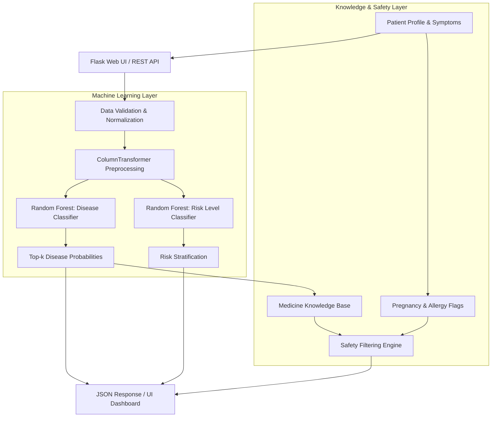

# 🩺 MediReco — Personalized Healthcare & Medicine Recommendation System

[](https://www.python.org/)
[](https://flask.palletsprojects.com/)
[](https://scikit-learn.org/)
[](https://pandas.pydata.org/)
[](https://docs.pytest.org/)
[](#safety-boundary)

An end-to-end **Data Science & Machine Learning** healthcare platform designed to provide personalized disease ranking, clinical risk stratification, and reference medicine information based on patient demographics and symptom profiles.

---

## 📌 Table of Contents

- [Overview](#-overview)
- [Key Features](#-key-features)
- [System Architecture](#-system-architecture)
- [Machine Learning & Pipeline Design](#-machine-learning--pipeline-design)
- [Project Directory Structure](#-project-directory-structure)
- [Installation & Setup](#-installation--setup)
- [Model Training & Knowledge Base Setup](#-model-training--knowledge-base-setup)
- [Running the Application](#-running-the-application)
- [API Reference](#-api-reference)
- [Testing & Quality Assurance](#-testing--quality-assurance)
- [Safety & Medical Ethics Boundary](#-safety--medical-ethics-boundary)
- [Interview & Viva Quick Guide](#-interview--viva-quick-guide)
- [Future Roadmap](#-future-roadmap)

---

## 🌟 Overview

Personalized healthcare systems address the limitation of one-size-fits-all medical advice. By analyzing patient-specific attributes (age, gender, blood pressure, cholesterol) alongside presenting symptoms (fever, cough, fatigue, breathing difficulty), **MediReco**:

1. Predicts top probable disease classes using an ensemble **Random Forest Classifier**.
2. Estimates the overall patient **Risk Level** (`High`, `Medium`, `Low`).
3. Queries an isolated knowledge base to return **contextual reference medicine information** tailored to the top predicted condition.
4. Provides safety safeguards (pregnancy cautions and allergy checks).
5. Serves predictions through both an interactive **Flask Web Interface** and a **RESTful JSON API**.

---

## 🚀 Key Features

- **Dual-Model ML Ensemble**:
  - **Disease Predictor**: Evaluates 8 demographic/symptom indicators to rank top-$k$ probable conditions.
  - **Risk Stratifier**: Estimates overall health risk classification.
- **Robust Feature Preprocessing**: Built using Scikit-Learn `Pipeline` and `ColumnTransformer` with automated categorical one-hot encoding and median/mode imputation.
- **Separation of Inference & Knowledge Retrieval**: Decouples probabilistic ML inference from deterministic reference medicine lookups, ensuring transparency and ease of audit.
- **Safety-Centric Recommendation Layer**:
  - Automatically flags pregnancy contraindications.
  - Detects potential allergen matches based on user input.
  - Strips prescription dosages to avoid self-medication risks.
- **Interactive Web UI & REST API**: Responsive modern interface for end-users and RESTful endpoints for third-party integration.

---

## 🏗 System Architecture



---

## 🧠 Machine Learning & Pipeline Design

### 1. Input Features

| Feature Name | Type | Description / Domain |
| :--- | :--- | :--- |
| `age` | Numeric | Patient age in years |
| `gender` | Categorical | `female`, `male`, `other` |
| `blood_pressure` | Numeric | Coded blood pressure level index |
| `cholesterol_level`| Numeric | Coded cholesterol level index |
| `fever` | Categorical | `yes`, `no` |
| `cough` | Categorical | `yes`, `no` |
| `fatigue` | Categorical | `yes`, `no` |
| `difficulty_breathing` | Categorical | `yes`, `no` |

### 2. Target Classes

The dataset groups diseases into 9 distinct categories:
- **Asthma**
- **Bronchitis**
- **Diabetes**
- **Hypertension**
- **Influenza**
- **Migraine**
- **Osteoporosis**
- **Stroke**
- **Other** *(aggregates long-tail rare conditions)*

### 3. Pipeline Architecture

```python
Pipeline([
    ('preprocess', ColumnTransformer([
        ('cat', Pipeline([
            ('imputer', SimpleImputer(strategy='most_frequent')),
            ('ohe', OneHotEncoder(handle_unknown='ignore'))
        ]), CAT_FEATURES),
        ('num', Pipeline([
            ('imputer', SimpleImputer(strategy='median'))
        ]), NUM_FEATURES)
    ])),
    ('model', RandomForestClassifier(
        n_estimators=500,
        max_depth=10,
        min_samples_leaf=2,
        random_state=42
    ))
])
```

---

## 📁 Project Directory Structure

```text
Personalized_Healthcare/
├── app.py                      # Flask application entry point & route definitions
├── run.py                      # Local server runner script
├── requirements.txt            # Project dependencies
├── pytest.ini                  # Pytest configuration
├── README.md                   # Project documentation
│
├── data/
│   ├── raw/
│   │   └── Cleaned_Dataset.csv         # Raw patient-symptom medical dataset
│   └── processed/
│       └── medicine_knowledge.csv      # Processed reference medicine database
│
├── models/
│   ├── disease_pipeline.joblib         # Serialized disease classification pipeline
│   ├── risk_pipeline.joblib            # Serialized risk level pipeline
│   ├── classes.json                    # Target class labels
│   └── metrics.json                    # Model evaluation metrics & reports
│
├── src/
│   └── medireco/
│       ├── __init__.py
│       ├── config.py           # Paths and configuration settings
│       ├── preprocess.py       # Data loading, validation, and schema definitions
│       ├── predictor.py        # Model loading & inference logic (cached)
│       ├── recommender.py      # Knowledge lookup and safety filter engine
│       └── train.py            # Core model training logic
│
├── scripts/
│   ├── build_medicine_db.py    # Generates processed medicine knowledge base
│   └── train_all.py            # End-to-end model training and artifact generation
│
├── templates/
│   └── index.html              # Modern web interface template
├── static/
│   └── style.css               # Styling and responsive layout
│
├── tests/
│   └── test_project.py         # Automated unit & integration tests
│
├── notebooks/
│   └── 01_train_and_evaluate.ipynb # EDA, training, and evaluation notebook
│
└── reports/
    ├── architecture.md         # Detailed architectural breakdown
    ├── model_card.md           # Model card & performance disclosures
    └── source_project_notes.txt# Project reference notes
```

---

## ⚙️ Installation & Setup

### 1. Prerequisites

- **Python 3.9+** installed on your system.
- Git (optional, for version control).

### 2. Clone / Open the Workspace

```bash
cd Personalized_Healthcare
```

### 3. Create and Activate a Virtual Environment

- **Windows (PowerShell):**
  ```powershell
  python -m venv .venv
  .venv\Scripts\Activate.ps1
  ```

- **Linux / macOS:**
  ```bash
  python3 -m venv .venv
  source .venv/bin/activate
  ```

### 4. Install Dependencies

```bash
pip install -r requirements.txt
```

---

## 🔄 Model Training & Knowledge Base Setup

To regenerate the medicine database and retrain the machine learning pipelines:

### 1. Build the Medicine Database
```bash
python scripts/build_medicine_db.py
```

### 2. Train Models and Generate Artifacts
- **Windows:**
  ```powershell
  $env:PYTHONPATH="src"
  python scripts/train_all.py
  ```

- **Linux / macOS:**
  ```bash
  PYTHONPATH=src python scripts/train_all.py
  ```

This outputs updated serialized models to `models/` along with `models/metrics.json`.

---

## 💻 Running the Application

Start the Flask development server:

```bash
python run.py
```

Open your browser and navigate to:
```
http://127.0.0.1:5000
```

---

## 📡 API Reference

### 1. Health Check

**Endpoint:** `GET /health`  
**Description:** Verify service health and project metadata.

```bash
curl -X GET http://127.0.0.1:5000/health
```

**Response (200 OK):**
```json
{
  "project": "Personalized Healthcare & Medicine Recommendation System",
  "status": "ok"
}
```

---

### 2. Analyze Profile & Recommend

**Endpoint:** `POST /api/analyze`  
**Headers:** `Content-Type: application/json`

**Sample Request Payload:**
```json
{
  "age": 28,
  "gender": "male",
  "blood_pressure": 1,
  "cholesterol_level": 1,
  "fever": "yes",
  "cough": "yes",
  "fatigue": "yes",
  "difficulty_breathing": "no",
  "pregnancy": false,
  "allergy": "penicillin"
}
```

**Sample Request with cURL:**
```bash
curl -X POST http://127.0.0.1:5000/api/analyze \
  -H "Content-Type: application/json" \
  -d '{
    "age": 28,
    "gender": "male",
    "blood_pressure": 1,
    "cholesterol_level": 1,
    "fever": "yes",
    "cough": "yes",
    "fatigue": "yes",
    "difficulty_breathing": "no",
    "pregnancy": false,
    "allergy": "penicillin"
  }'
```

**Sample Response (200 OK):**
```json
{
  "disclaimer": "Educational decision support only. Not a diagnosis, prescription, or substitute for professional medical care.",
  "medicine_information": [
    {
      "category": "Antipyretic / Analgesic",
      "information": "Commonly used for symptomatic relief of fever and body ache.",
      "medicine": "Paracetamol",
      "safety_note": "Reference information only. Verify suitability with a licensed clinician or pharmacist."
    }
  ],
  "predictions": [
    {
      "disease": "Influenza",
      "probability": 0.6842
    },
    {
      "disease": "Bronchitis",
      "probability": 0.1825
    },
    {
      "disease": "Other",
      "probability": 0.0811
    }
  ],
  "risk": {
    "probabilities": {
      "High": 0.12,
      "Low": 0.65,
      "Medium": 0.23
    },
    "risk_level": "Low"
  }
}
```

---

## 🧪 Testing & Quality Assurance

Automated test suites verify dataset integrity, column schemas, and model metric availability:

```bash
pytest -q
```

---

## ⚠️ Safety & Medical Ethics Boundary

> [!IMPORTANT]
> **Educational & Portfolio Decision-Support System Only**
>
> 1. **No Medical Diagnosis**: This software does not provide medical diagnoses or replace consultations with licensed physicians.
> 2. **No Prescriptions / Dosages**: Dosage guidelines and frequencies have been intentionally excluded to prevent unverified self-treatment.
> 3. **Imbalanced Dataset Notice**: Predictions are derived from a compact academic dataset. Real-world clinical decision tools require large, multi-center, calibrated datasets with stringent regulatory validation.

---

## 🎓 Interview & Viva Quick Guide

When discussing or presenting this project:

- **Problem Statement**: Standard healthcare advice is often generic; personalized decision support accounts for patient-specific demographic factors, comorbidities, and symptoms.
- **Model Choice**: **Random Forest Classifiers** were chosen for their ensemble stability, resistance to overfitting on small feature spaces, and ability to generate calibrated class probability distributions.
- **Handling Class Imbalance**: Due to rare disease classes, non-dominant conditions are grouped into an explicit `Other` class, and evaluation measures both **Accuracy** and **Balanced Accuracy**.
- **Architecture Decoupling**: The system strictly isolates the **ML prediction pipeline** from the **Knowledge Retrieval layer**, ensuring medical knowledge updates do not require model retraining.
- **Clinical Safety Rules**: Implements rule-based safety wrappers for pregnancy and allergen detection on top of model inferences.

---

## 🔮 Future Roadmap

- [ ] Transition from static knowledge tables to dynamic FHIR / PubMed / ChEMBL biomedical knowledge graphs.
- [ ] Incorporate model explainability tools (**SHAP** / **LIME**) for feature importance visualization per patient.
- [ ] Add calibrated uncertainty estimation thresholds (abstaining when prediction entropy is high).
- [ ] Implement HIPAA / GDPR compliant audit logging and role-based access control (RBAC).

---

## 📄 License

This project is open-source and intended for academic, portfolio, and educational purposes.
